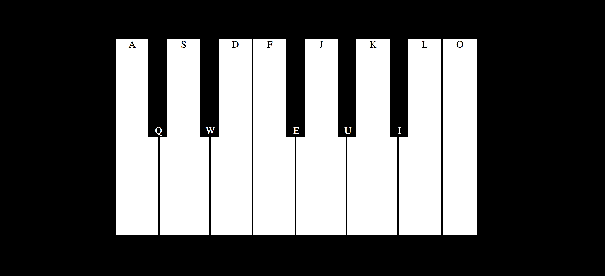

# Piano

[Working example](https://yhabib.github.io/UI_Exercises/piano/index.html)

In this exercise we are going to create this digital piano. The task is divided in two parts:
1. Recreate the layout, you can also make use of your own design.
2. Adding a sound to each key.



We make use of the `data-*` attribute to bind a piano key to a sound, so it makes it easy to find them later in our JS.
```javascript
<div data-key="KeyA" class="piano-key"><div>A</div></div>
<audio data-key="KeyA" src="wav/c1.wav"></audio>
```

Later in the `EventListener` we check wich key was pressed by using it again:
```javascript
document.querySelector(`audio[data-key="${e.code}"]`)
```

All the necessary sounds can be found in the `/wav` folder.

## Keywords
* `audio`: A new HTML5 tag
* `data-*`: A customizable HTML property
* `addEventListener`: When the apropriate key is pressed the related event should be triggered, reproducing the sound.
