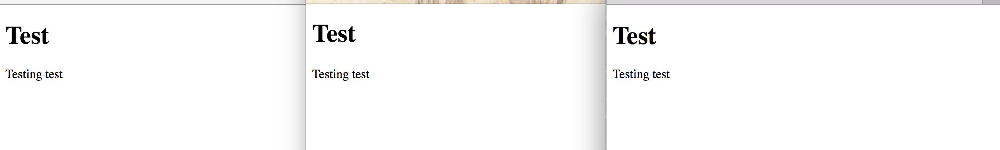
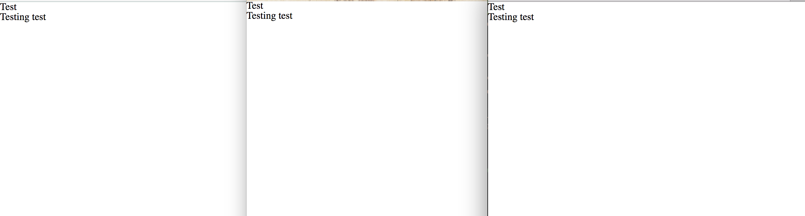

# UI basic exercises
Some exercises to practice HTML, CSS and JS.

## Concepts
* CSS cascading and inheritance
* CSS boxing and disposition
* CSS transitions and transformations
* HTML new tags
* JS basic DOM manipulation
* Git collaboration

## Table of contents
* [Styling buttons](./styledButton) 
* [Piano](./piano)
* [My Portfolio Page](./profilePage)

## How to get starting
1. Fork the repo
2. Create a new branch with your github name:
  * `git checkout -b <github-username>`
3. Start to code your solutions in the templates

## General Notes
### Reset styles
All browsers have some styles by default that can tend to unexpected results. For example in the picture below we can see how is rendered by default in Chrome, Firefox and Safari. Usually IE would be even worst 😂:


In order to avoid it we reset these default styles by using for example [Meyers reset](http://meyerweb.com/eric/tools/css/reset/)

And now our page is going to look the same in all browsers:


For that we just add the reset file in the css folders and we added as the first stylesheet in the `index.html`. It is important to put it the first so later on our own styles will override it. 
The process is similar to painting a wall:
1. We paint it white(reset).
2. We paint it the way we want(custom styles).


### GitHub Forking
So what does it mean to fork a project:
> Fork is a copy of a repository. Forking a repository allows you to freely experiment with changes without affecting the original project. Most commonly, forks are used to either propose changes to someone else's project or to use someone else's project as a starting point for your own idea. 
> - GitHub docs

A list of useful actions when working with a fork:
 * Keeping your fork up to date:
  * Add a new remote(we do it only once):
  ```bash
  # Add 'upstream' repo to list of remotes
  git remote add upstream https://github.com/UPSTREAM-USER/ORIGINAL-PROJECT.git
  # Verify the new remote named 'upstream'
  git remote -v
  ```
  * Update local version:
  ```bash
  # Fetch from upstream remote
  git fetch upstream
  # View all branches, including those from upstream
  git branch -va
  # Checkout your master branch and merge upstream
  git checkout master
  git merge upstream/master
  ```
* Doing your work:
  * Create a new branch and start to work on it:
  ```bash
  # Checkout the master branch - you want your new branch to come from master
  git checkout master
  # Create a new branch named newfeature (give your branch its own simple informative name)
  git branch newfeature
  # Switch to your new branch
  git checkout newfeature
  ```
  * Making a pull request:
  ```bash
  # Fetch upstream master and merge with your repo's master branch, same as before to update your local forked version
  git fetch upstream
  git checkout master
  git merge upstream/master

  # If there were any new commits, rebase your development branch
  git checkout newfeature
  git rebase master

  # Rebase all commits on your development branch, in case you want to squash some of your small commits into bigger ones 
  git checkout 
  git rebase -i master
  ```
* Submitting: Once you've committed and pushed all of your changes to GitHub, go to the page for your fork on GitHub, select your **branch**, and click the pull request button.
